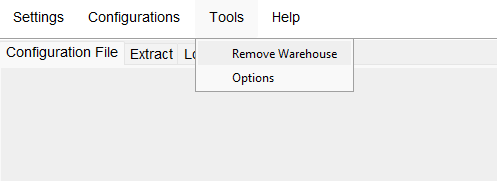
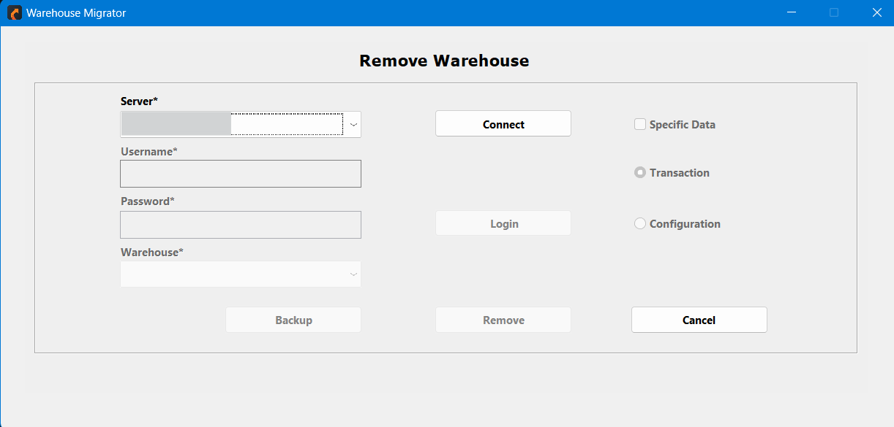
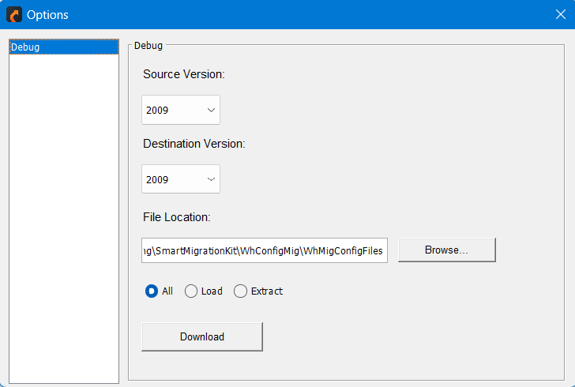

## Tools

### Remove Warehouse

### Server (Required)
- Dropdown to select the server where the warehouse resides.

### Connect
- Establishes a connection to the selected server.

### User Authentication
- Fields for entering **Username** and **Password** to authenticate access to the server.

### Login
- Logs the user into the selected server.

### Warehouse Selection (Required)
- Dropdown to choose the specific warehouse for removal.

### Data Removal Options
- **Specific Data**: Checkbox to remove specific data from the warehouse.
- Radio buttons to choose the type of data to remove:
  - **Transaction**: Removes transaction-related data.
  - **Configuration**: Removes configuration-related data.

### Backup Option
- **Backup**: Creates a backup of the warehouse data before initiating removal.

### Action Buttons
- **Remove**: Executes the warehouse removal process based on the specified options.
- **Cancel**: Discards changes and exits the interface.

This interface provides secure and customizable options for managing warehouse removal while allowing for data-specific actions and backups.

---

## Options Submenu

