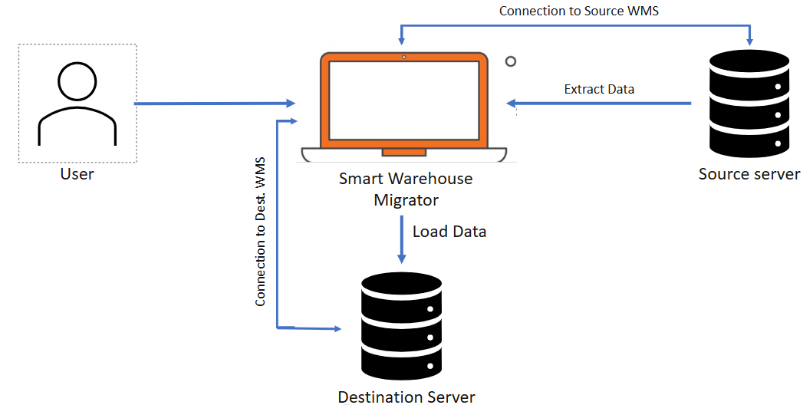

# Concept

## Problem Statement

Migrating warehouse configurations in Blue Yonder Warehouse Management System (WMS) environments is a critical but highly complex activity.

Organizations typically face three primary hurdles:

### 1. Technical Complexity
The architecture of a WMS makes manual data movement inherently difficult:

* **Massive Data Scale:** Handling hundreds of configuration tables simultaneously.
* **Inter-table Dependencies:** Managing complex relational links where one missing record can cause system-wide failures.
* **Customization:** Incorporating bespoke tables and unique scripts that sit outside the standard BlueYonder schemas.
* **Schema Evolution:** Navigating structural changes and data mapping challenges during version upgrades (e.g., migrating from 2020 to 2023).

### 2. Typical Migration Scenarios
The need for migration isn't a one-time event; it occurs throughout the software development lifecycle (SDLC):

* **Promotion:** Moving validated changes from **DEV → TEST** for verification.
* **Go-Live:** Deploying finalized configurations from **TEST → PROD** for production use.
* **Expansion:** Creating new warehouse instances or executing multi-client rollouts.
* **Infrastructure:** Moving data during server migrations, cloud transitions.

### 3. Business Risks
Without an automated framework, businesses often encounter:

* **Extended Timelines:** Manual recreation of data leads to longer implementation cycles.

* **Increased Costs:** Heavy reliance on manual consulting hours.

* **Operational Instability:** Human error during manual entry can lead to production downtime or failed User Acceptance Testing (UAT).

## Our Solution

Smart Warehouse Migrator is designed to automate warehouse configuration creation and migration within Blue Yonder WMS environments. It provides a structured, reliable, and controlled approach to configuration management

The solution works by:

**1. Extract – Source Capture**  
The tool extracts configuration from the source environment

**2. Structure – File Organization**  
Extracted data is organized into portable, structured migration files.

**3. Load – Destination Injection**  
The structured configuration files are seamlessly imported into the target environment with minimal user intervention.

**4. Validate – Integrity Check**  
After loading, the tool performs validation checks to ensure that the migrated configuration is complete, consistent, and functionally aligned with the original source configuration.

## Workflow

  

  
   

   
---