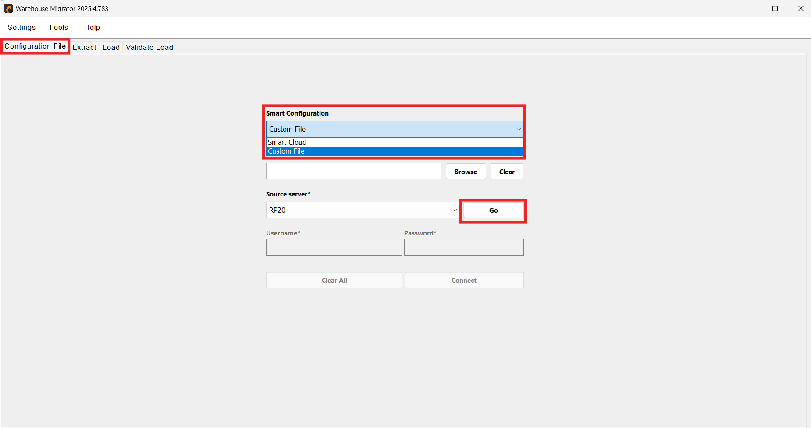
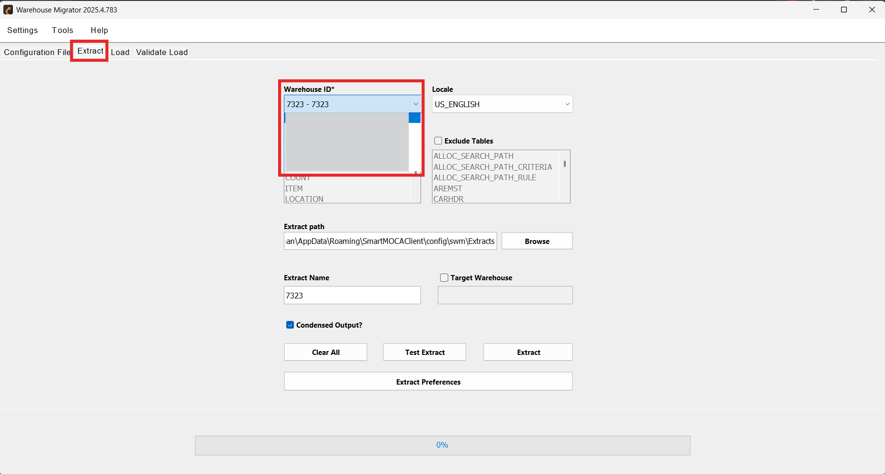
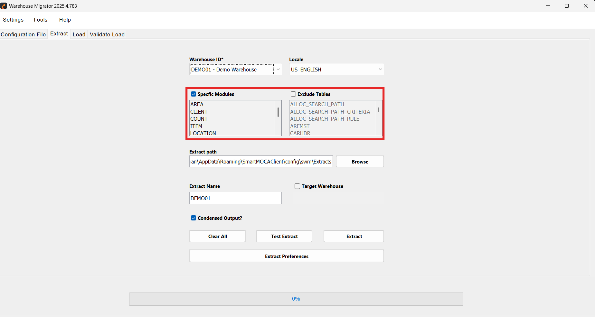
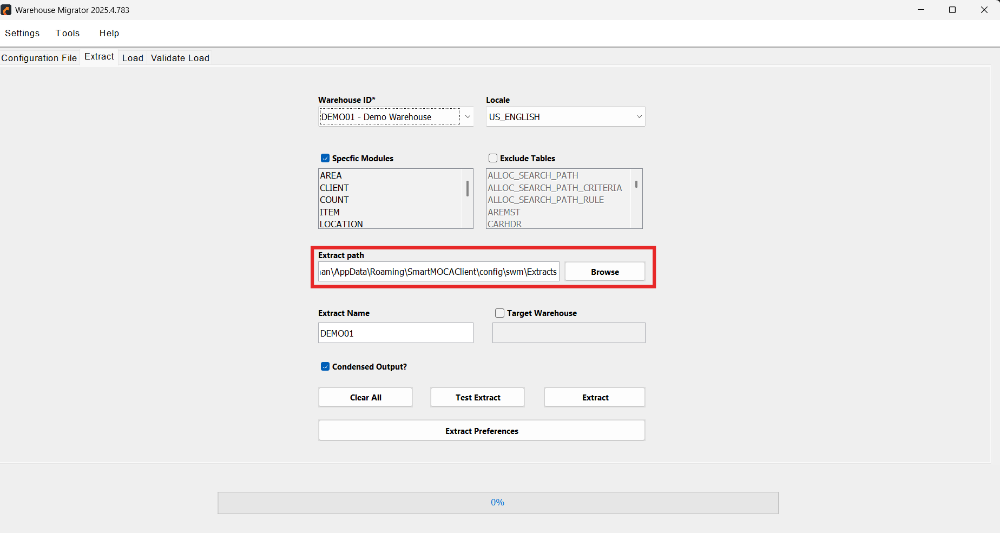
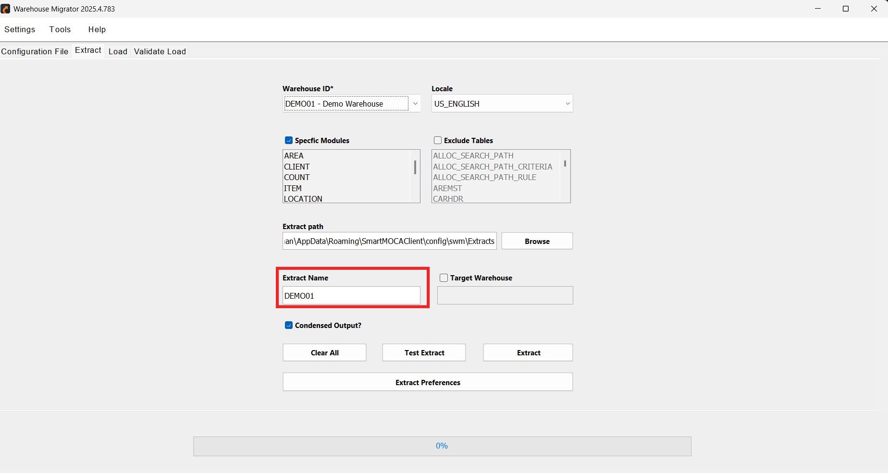
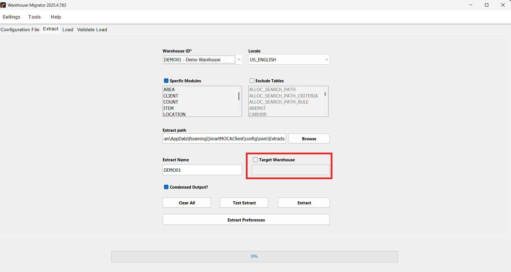
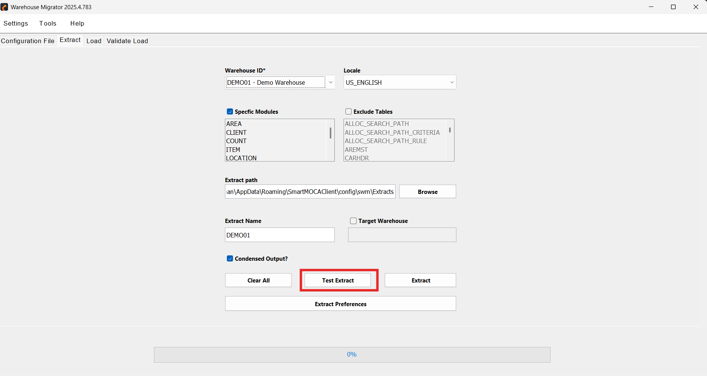
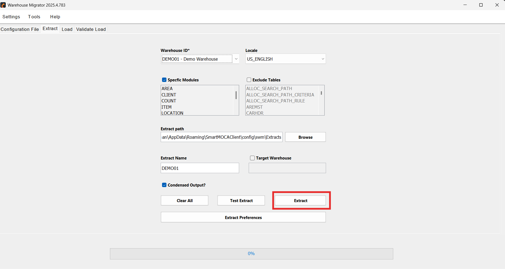
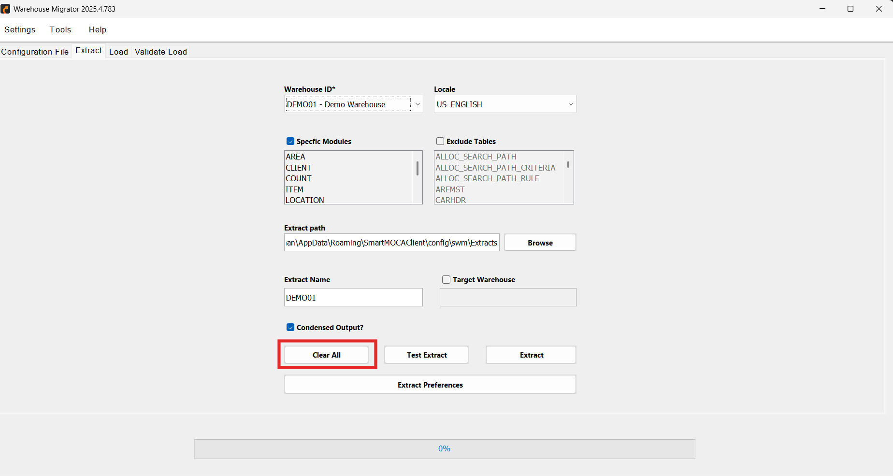

# Extract 

The Extract feature is the first and most critical phase of the Warehouse Migrator lifecycle. It captures a structured snapshot of warehouse configuration data from the source environment and prepares it for controlled migration.

## Purpose 
The Extract feature is designed to:

- **Capture Configuration Snapshot**  
  Create a reliable snapshot of the warehouse configuration at a specific point in time.

- **Maintain Structured Data Export**  
  Organize extracted data in a structured format that preserves table relationships and dependencies.

- **Prepare for Migration**  
  Generate migration-ready files that can be loaded into a target environment in a controlled manner.

## Use Cases

Depending on the migration scenario, different extraction strategies can be applied:

**New Warehouse Setup - Full Extraction:**   
Extract the complete warehouse configuration to replicate the entire setup in a new environment.

**Module Upgrade - Module Specific Extraction:** 
Extract only the affected module to minimize impact and ensure focused migration.

**Custom Table Fix - Specific Table Extraction**
Extract only the relevant table(s) to address targeted configuration updates.

## How to Extract 

Follow the steps below to perform a warehouse configuration extraction:

1. Navigate to the **Configuration** tab and connect to the source environment using one of the following methods:
  - **Cloud Connect**, or  
  - **XML Configuration File** 

  

     
    

Enter your server credentials and establish the connection.  Once connected successfully, you are ready to proceed with extraction.

2. Move to the **Extract** tab and select the **Warehouse ID** you want to extract from the dropdown. 

  

     
    

3.  If required, enable additional options to:
  - Extract specific modules only, or  
  - Exclude certain tables from the extraction  

    

     
    

    When a specific module is selected, only tables related to that module are available for exclusion. If no module is selected, tables can still be manually excluded.

4. Choose the location where the extract folder will be created.   

     By default, the extract path is set to the **WhConfig** folder inside the application directory. 

    

     
    

     This path can also be configured in **Settings > User Preferences**.

5. Now enter a name for the extract folder. 

    

     
    

     If no name is provided, the system automatically uses the selected **Warehouse Name** as the default folder name.

6. The **Target Warehouse** option allows you to assign a different warehouse name within the extracted files.

    

     
    

    This is particularly useful when:

    - Cloning a warehouse configuration  
    - Preparing extract files for a new warehouse setup  
    - Performing warehouse-to-warehouse migration within the same instance  

    If not specified, the source warehouse name is retained in the extract.

7. Before running a full extraction, click **Test Extract**.

    

     
    

    This will:

    - Retrieve the first 10 rows of each selected table  
    - Allow verification of selected modules and exclusions  
    - Confirm that the correct data is being targeted 

8. Click **Extract** to begin the full extraction process.

    

     
    

    During execution:

    - Data is organized into structured folders  
    - Each folder follows a defined sequence number  
    - The sequence maintains parent-child table relationships  
    - The same order is preserved during the Load phase 

9. The **Clear All** button resets:

    

     
    

    - Source server connection  
    - Login credentials  
    - Selected warehouse and extraction settings  

    This option allows users to start a fresh extraction session without residual configuration.

## Review Extract Output
Once extraction is completed:

- A structured extract folder is generated at the selected path  
- Folder names may include date/version identifiers  
- A migration log file is automatically created  

The log file provides a detailed record of the extraction process for validation, troubleshooting, and audit purposes.

---