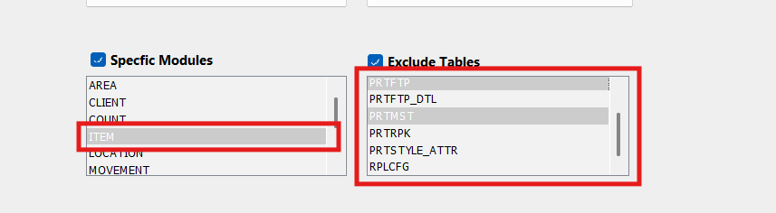

# Extract 

The extraction process is customizable, allowing users to extract data based on their specific needs, whether it's for an entire warehouse, certain modules, or individual tables.
    

- **Extraction Options**

    - **Assign Warehouse ID and Locale:**    
      These options enable users to specify the warehouse and locale settings from which they want to extract data.

    - **Specify Modules and Exclude Tables:**  
      Users can fine-tune the extraction process by selecting only relevant modules or tables and excluding unnecessary ones. This is particularly useful for focusing on specific aspects of warehouse data.

      

        
      

    - When a user selects a specific module (e.g., ITEM) from the Specific Modules list, the Exclude Tables section should dynamically display only the tables related to the selected module. Users should be able to select and exclude multiple tables from this filtered list during extraction.

        

          
        

    - If no specific module is selected, users can still exclude multiple tables by manually selecting them from the Exclude Tables list.

    - **Specify Extract Path and Name:**  
      These options allow users to specify where the extracted data will be saved and name the extracted folder. This customization helps users organize their data effectively. Default Extract Path can be set in **Settings > User Preferences**.

    - **Rename Target Warehouse:**  
      This option allows users to rename the extracted warehouse folder.

    - **Condensed Output:**  
      This feature streamlines the extraction process by excluding empty tables, reducing the size and complexity of the extracted data.

    - **Clear All:**  
      The "Clear All" option resets the application, including the Source Server and login information, allowing users to start fresh.

    - **Test Extract:**  
      Before performing a full extraction, users can run a test extract to preview the first 10 rows of each table. This ensures that the correct data is being targeted without committing to a full extraction.

    - **Extract:**  
      This option allows performing a full extraction. It enables further customization by letting users exclude specific columns from the extraction, such as ID fields or non-essential columns, tailoring the output to their precise requirements.

    - **Extract Preferences:**  
      The Extract Preference feature allows users to customize their data extraction process by excluding specific columns from the output. This ensures greater control over the extracted data, allowing users to focus on only the relevant information.

       

         
        

    ### **Option For Extract Preferences**

    1. **Exclude Columns**: Users can selectively exclude columns from the extract through an intuitive dialogue box. This interface allows for easy customization of the extracted data.
    2. **Hide ID Fields**: Within the dialogue box, users can choose to hide ID fields. By default, certain column names are pre-selected, but users can toggle these options on or off as needed. Additional columns can also be added to the exclusion list for further customization.
    3. **Hide Warehouse ID**: When enabled, the WH_ID (Warehouse ID) column is excluded from the extract file. This ensures that the Warehouse ID is omitted from the extracted data, maintaining data privacy and relevance.
    4. **Hide ID Columns**: When this option is selected, all ID columns are excluded from the extract files. This simplifies the extracted data by removing potentially non-essential identifier fields.
    5. **Add Columns to Hide**: This functionality allows users to add additional columns to the exclusion list as required. Users can specify any non-essential or irrelevant columns for exclusion.
    6. **Hide Non-Essential Columns**: When checked, this option excludes all non-essential ID columns from the extract files. It streamlines the data, ensuring only critical fields are retained.
    7. **Add Non-Essential Columns to Hide**: This feature enables users to specify additional non-essential columns for exclusion, offering greater flexibility and precision.

    - **Log File**

        After the extraction is complete, a log file is automatically generated. This file provides a detailed record of the extraction process, which is useful for:

        - Troubleshooting issues.
        - Verifying that the extraction was successful.
  
    ### Key Features:
    - **Customizable Extraction:** Extract entire warehouses, specific modules, or individual tables with options to exclude unnecessary data
    - **Extract Preferences:** Fine-tune output by excluding columns, hiding ID fields, or focusing on critical data.
    - **Test and Log Features:** Preview extractions with a test run and access detailed logs for troubleshooting and verification.

    ---