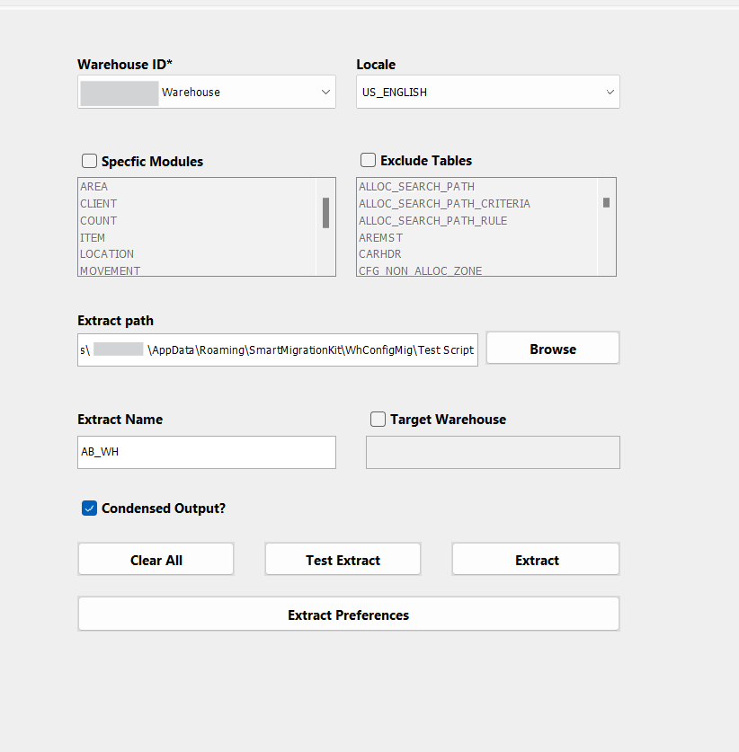
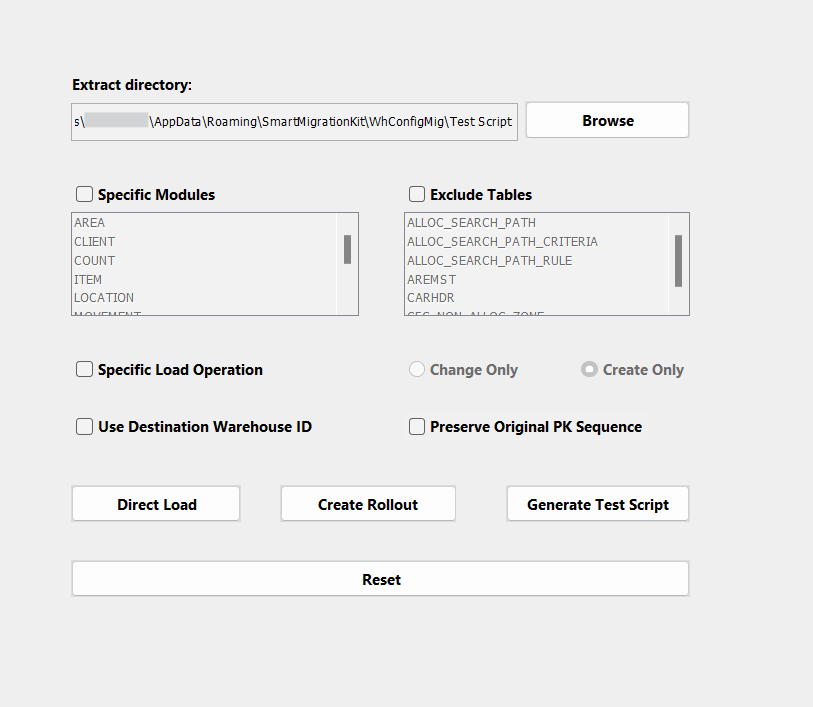
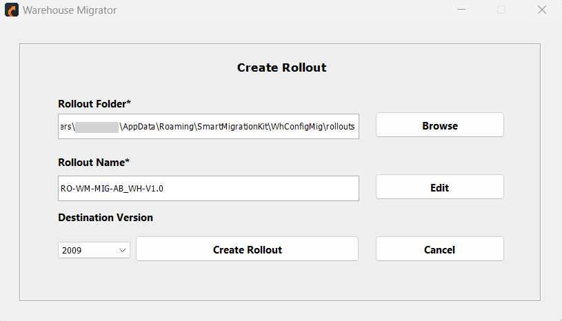

# Smart Migrator Features

Smart Migrator simplifies data migration with key functionalities:

- Configuration File  
- Extract  
- Load  
- Validate Load  

## Configuration File Setup

The Smart Warehouse Migrator offers two methods for configuration:

  1. **Using the Smart API**: Provides a streamlined setup process.

  2. **Custom Configuration File**: Allows you to provide your own file for  Smart Configuration tab and then browse your file.

- After selecting the configuration file, you need to choose your source server and establish a connection by entering your username and password.

These configuration files specify:

- How data is extracted from source systems.
- How data is loaded into target systems.
- Settings and parameters for:
  - Data extraction processes.
  - Mapping source data to target structures.
  - Applying necessary transformations.

### Key Features:
- **Dual Methods:** Configure via Smart API or custom file upload.
- **Source Connectivity:** Securely connect to source servers with credentials.
- **Data Workflow:** Define extraction, loading, mapping, and transformation processes.
- **Flexible Settings:** Customize parameters for efficient data migration.

## Extract Data

The extraction process is customizable, allowing users to extract data based on their specific needs, whether it's for an entire warehouse, certain modules, or individual tables.

- **Extraction Options**

  - **Assign Warehouse ID and Locale:**    
      These options enable users to specify the warehouse and locale settings from which they want to extract data.

  - **Specify Modules and Exclude Tables:**  
      Users can fine-tune the extraction process by selecting only relevant modules or tables and excluding unnecessary ones. This is particularly useful for focusing on specific aspects of warehouse data.

  - **Specify Extract Path and Name:**  
      These options allow users to specify where the extracted data will be saved and name the extracted folder. This customization helps users organize their data effectively. Default Extract Path can be set in **Settings > User Preferences**.

  - **Rename Target Warehouse:**  
      This option allows users to rename the extracted warehouse folder.

  - **Condensed Output:**  
      This feature streamlines the extraction process by excluding empty tables, reducing the size and complexity of the extracted data.

  - **Clear All:**  
      The "Clear All" option resets the application, including the Source Server and login information, allowing users to start fresh.

  - **Test Extract:**  
      Before performing a full extraction, users can run a test extract to preview the first 10 rows of each table. This ensures that the correct data is being targeted without committing to a full extraction.

  - **Extract:**  
      This option allows performing a full extraction. It enables further customization by letting users exclude specific columns from the extraction, such as ID fields or non-essential columns, tailoring the output to their precise requirements.

  - **Extract Preferences:**  
      The Extract Preference feature allows users to customize their data extraction process by excluding specific columns from the output. This ensures greater control over the extracted data, allowing users to focus on only the relevant information.
    

- **Option For Extract Preferences**

    1. **Exclude Columns**: Users can selectively exclude columns from the extract through an intuitive dialogue box. This interface allows for easy customization of the extracted data.
   2. **Hide ID Fields**: Within the dialogue box, users can choose to hide ID fields. By default, certain column names are pre-selected, but users can toggle these options on or off as needed. Additional columns can also be added to the exclusion list for further customization.
    3. **Hide Warehouse ID**: When enabled, the WH_ID (Warehouse ID) column is excluded from the extract file. This ensures that the Warehouse ID is omitted from the extracted data, maintaining data privacy and relevance.
    4. **Hide ID Columns**: When this option is selected, all ID columns are excluded from the extract files. This simplifies the extracted data by removing potentially non-essential identifier fields.
    5. **Add Columns to Hide**: This functionality allows users to add additional columns to the exclusion list as required. Users can specify any non-essential or irrelevant columns for exclusion.
    6. **Hide Non-Essential Columns**: When checked, this option excludes all non-essential ID columns from the extract files. It streamlines the data, ensuring only critical fields are retained.
    7. **Add Non-Essential Columns to Hide**: This feature enables users to specify additional non-essential columns for exclusion, offering greater flexibility and precision.

  - **Log File**

      After the extraction is complete, a log file is automatically generated. This file provides a detailed record of the extraction process, which is useful for:

      - Troubleshooting issues.
      - Verifying that the extraction was successful.
  
  ### Key Features:
  - **Customizable Extraction:** Extract entire warehouses, specific modules, or individual tables with options to exclude unnecessary data
  - **Extract Preferences:** Fine-tune output by excluding columns, hiding ID fields, or focusing on critical data.
  - **Test and Log Features:** Preview extractions with a test run and access detailed logs for troubleshooting and verification.

## Load Tab Overview

The **Load Tab** enables users to load extracted data onto the server by specifying the extraction path. Two main methods are available for loading the data: **Direct Load** and **Create Rollout**, each catering to different needs.

  

## Load Methods

  1. **Direct Load:** 
    Directly loads extracted data onto the destination server by specifying the data path.

       **Key Features:**
        - Supports remote data loading via remote calls between environments.
        - Ideal for quick and straightforward data loading tasks.

  2. **Create Rollout**

      Creates a rollout file, specifying the data path and details about custom tables to be created.

        **Key Features:**
       - The rollout file can be used with Perl to load data and set up tables in any environment.
       - Provides flexibility for more complex and controlled setups.

---

## Load Tab Components

  - **Extract Directory**
    - Specifies the directory path where the **Warehouse (WH)** data will be loaded.

  - **Specific Modules**
    - Filters modules and tables from the load file, enabling users to focus on specific datasets.

  - **Exclude Tables**
    - Allows filtering to exclude selected tables from being loaded based on the chosen modules.

  - **Specific Load Operation**
    - Choose between different load methods for specific operations:
    - **Change Only**: Loads only modified data, ideal for incremental updates.
    - **Create Only**: Loads and creates new data and tables without modifying existing data. Suitable for initializing new datasets.

- **Use Destination Warehouse ID**
  - Retrieves the default **Warehouse ID** (def_flg 1) from the connected environment.
  - Note: If the **Hide WH_ID** option is enabled in user preferences, this option must be checked to retrieve the default Warehouse ID.
  

---

- **Direct Load**

 
This method directly loads the extracted data onto the destination server with a simple click and selection process. Remote loading between different environments is supported through remote calls.

 **Key Options:**

  - **Destination Server**: Specifies the target environment for the data load.
  - **Remote Server**: Facilitates loading data remotely to another environment.
  - Requires connection to the environment specified as the **Destination Server**.
  - **Remote Load**: Enables remote load operations between environments.
  - **Test Load**: Performs a test load, where only the first 10 rows of each table are loaded to the target environment for verification before full data loading.
  - **Load**: Initiates the loading process after completing all fields.

---

- **Create Rollout**
  
This method allows the creation of a rollout file for more complex setups, which can be later used to load data and create tables using Perl in any environment.

  - **Steps:**
    1. Specify the rollout directory.
    2. Optionally, customize the naming convention of the rollout file.
    3. Fill in required fields and generate the rollout.

      

The rollout file contains all necessary data and table details, which can be loaded into any environment using Perl.

- **Generate Test Script**
  - Creates a test script that loads only the first 10 rows of data, offering a way to test the data loading process without performing a full load.

  

---

- **Notes:**
  - **Test Load** is useful for validating the setup before committing to a full data load.
  - **Create Rollout** is best for complex scenarios that require more control and flexibility during the data setup and loading process.

## Validate Load Overview

The **Validate Load** feature ensures that the data loaded into the destination database matches the extracted data. It helps identify errors and discrepancies during the data loading process, ensuring data integrity.

---

### Key Features

  - **Data Validation**
    - Compares the data loaded in the destination database with the extracted data to ensure accuracy and consistency.

  - **Error Logs**
    - Provides error logs in case of discrepancies or issues during the data loading, aiding in troubleshooting.

---

## Validate Load Components

- **Destination Server (Dest Server)**
  - Refers to the target environment where the data is being loaded.

- **Extract Path**
  - Allows users to select the folder containing the extracted data for validation.

- **Validate**
  - After selecting the destination server and extract folder:
    1. Choose the warehouse and locale ID.
    2. Initiates the validation process.
    3. Compares the data in the target environment with the data in the extract folder.
    4. Highlights discrepancies or missing data.
    5. Displays results in a grid format for easy review.

- **Save Results**
  - Saves the validation results in CSV format for record-keeping or further analysis.

---

- **Notes:**
  - **Data Validation** is crucial for ensuring the integrity of data after it has been loaded into the destination server.
  - **Error Logs** offer a detailed record of issues to assist in resolving any discrepancies that may arise during the loading process.
