## Get started with Warehouse Migrator

This section will guide you through the initial steps to get you up and running with our powerful and intuitive software. 

## Pre-Requisites for using Warehouse Migrator

Following are the pre-requisites before launching warehouse migrator:

### System Requirements

Ensure your system meets the following minimum requirements before proceeding:

- Operating System:
    <dd>- Windows 7 or later</dd>
- Processor:
    <dd>- Intel Core i3 or equivalent
- Memory:
    <dd>- 4 GB RAM</dd>
- Storage:
    <dd>- 500 MB available space</dd>
- Internet Connection: 
    <dd>- Required for initial setup and updates</dd>
- Java Version: 
    <dd>- Java 1.8 or higher</dd>

### Smart Moca Client Installation

To use the Warehouse Migrator tool, the MOCA Client must be installed. 

- If not installed, follow the instructions at [Smart Moca Client-Installation](https://oracularis.github.io/mocaclient/#/./getting-started?id=installation).
  
### Handling moca.jar file to launch WH migrator

On initial Smart MOCA Client installation, by default system includes ossimoca.jar in the `C:\Program Files (x86)\Oracular MOCA Client\lib` directory instead of moca.jar. 

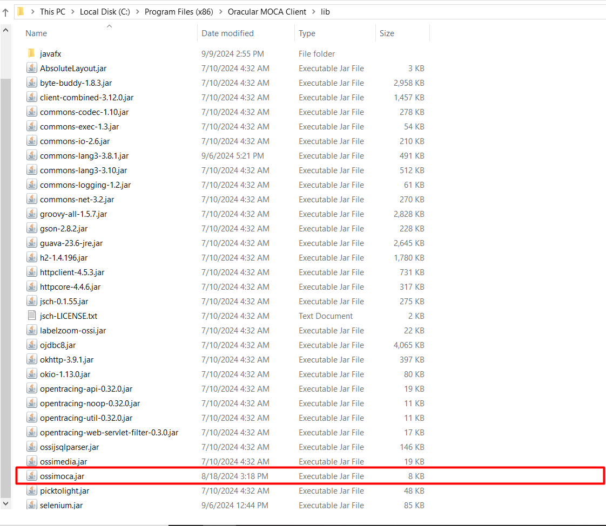

However to launch warehouse migrator, it is recommended to use BlueYonder's moca.jar instead of ossimoca.jar.

Follow the steps below to use moca.jar:

1. Navigate to the $MOCADIR/lib, located in your Moca Installation folder.
2. Remove the existing ossimoca.jar file.
3. Place Blueyonder's moca.jar file in the same location.

    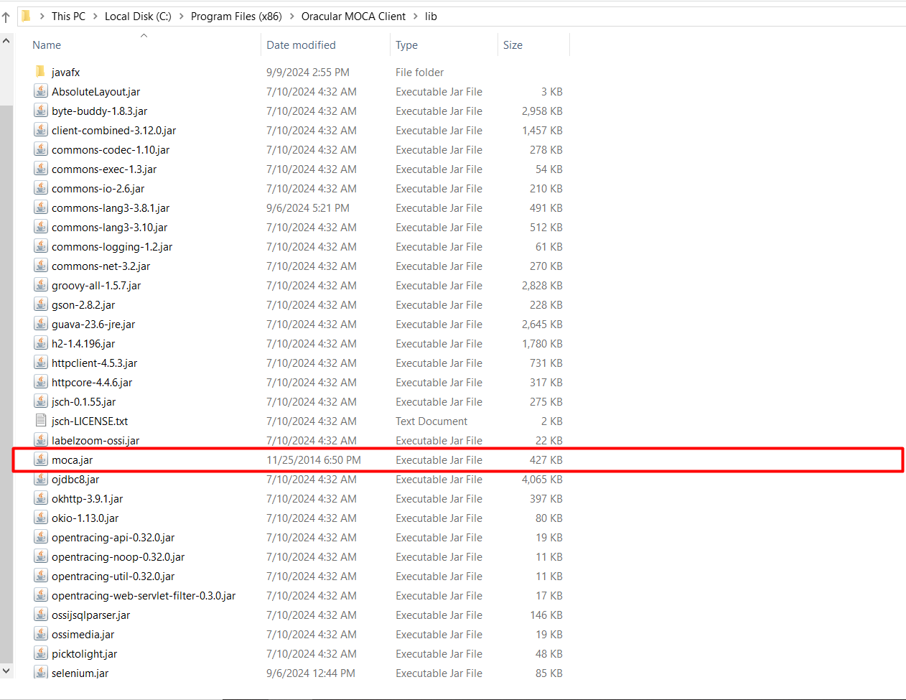

This process will allow you to launch warehouse migrator within Smart Moca Client successfully.

### Environment Setup for Warehouse Migrator

- To setup your servers, navigate to File > Edit Servers from top menu bar.

  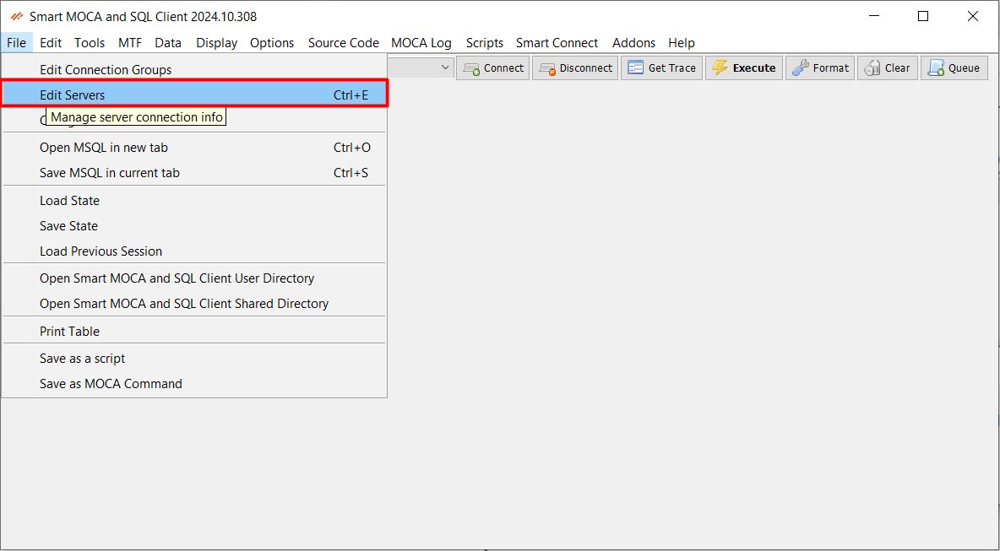

- Fill out the details by ensuring your MOCA connection URL includes /service and click on 'Add/Update' button to add server information.
  - If the URL is missing /service, add the connection details for the server where you intend to run the migrator.
  
  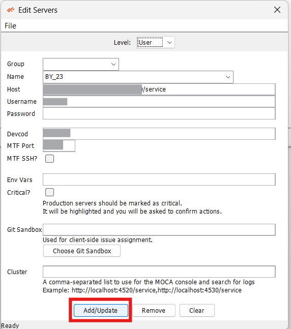

- Now choose a server name and click on 'Connect' button or press Alt + C.

  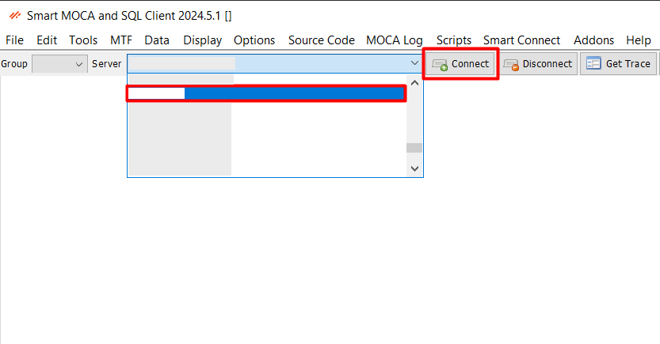

### Warehouse Migrator Cloud Connect
After successfull installation of Smart Moca Client, we have to configure the Warehouse Migrator. 

To configure warehouse migrator in smart moca client, follow the instructions below:

-	Go to [Smart Apps](https://apps.smart-is.com/) or scan the QR code and create your account.
  
  

-	After signing in, open your profile by clicking on top right profile icon and select “Profile” option. 
  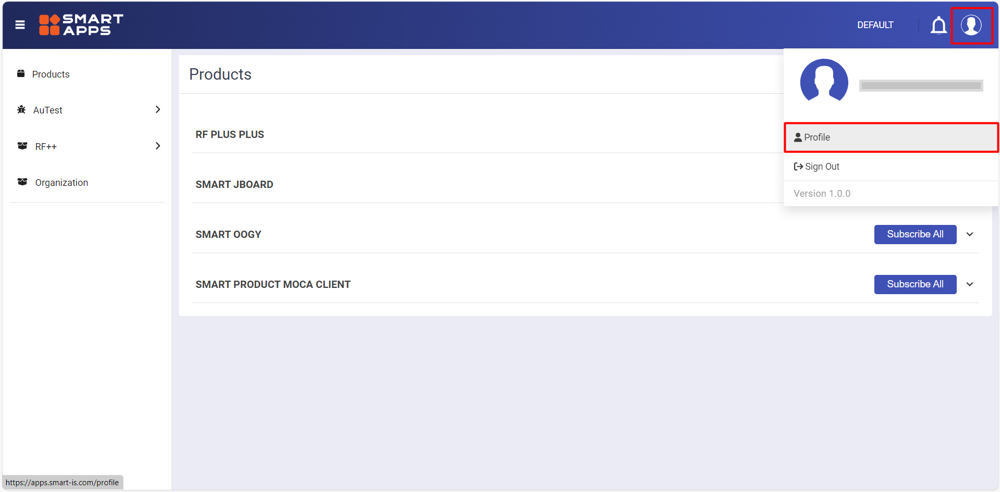

-	Press the Add button to create your api key. 
  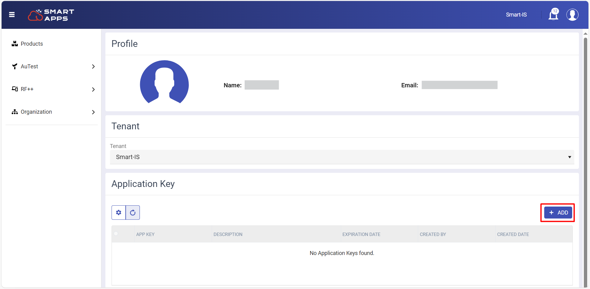

- Now give description to your app key and click on "Generate" button. 
  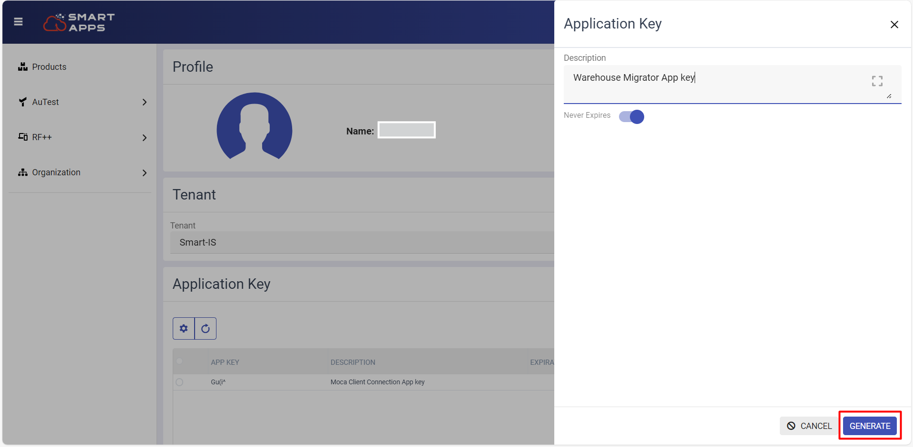

-	This action will generate a new one-time generated app key containing all your license information. Once the app key is generated, copy it to your clipboard. 
  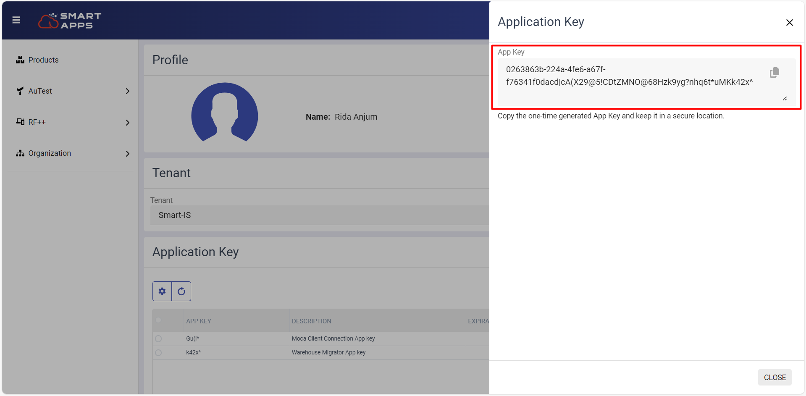

- Now navigate to the Smart Connect --> Cloud Connect from dropdown menu and enter key which is generated from website and press 'Save' Key button.
  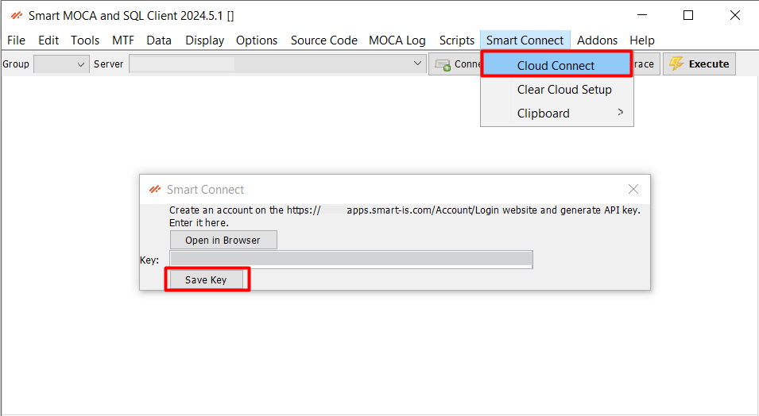

## Launching Warehouse Migrator
Follow below steps to launch warehouse migrator:

- Once connected to the server, navigate to Addons > Smart Innovations > Warehouse Migrator.

  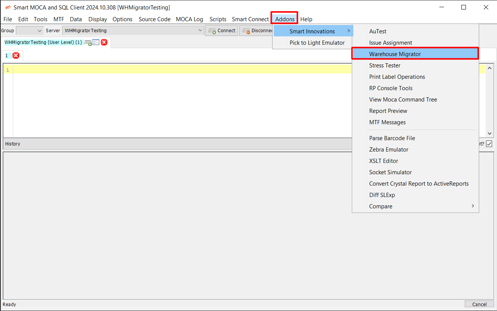

- The Warehouse Migrator will get launch, indicating that the configuration was successful and the tool is ready for use.

  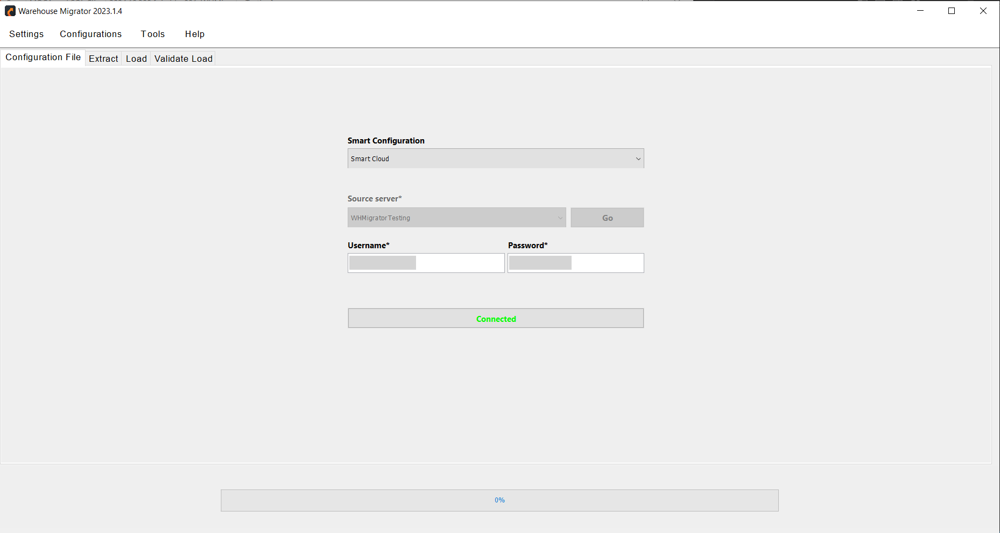

