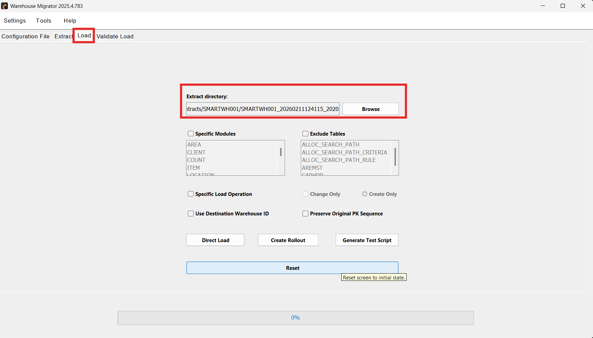
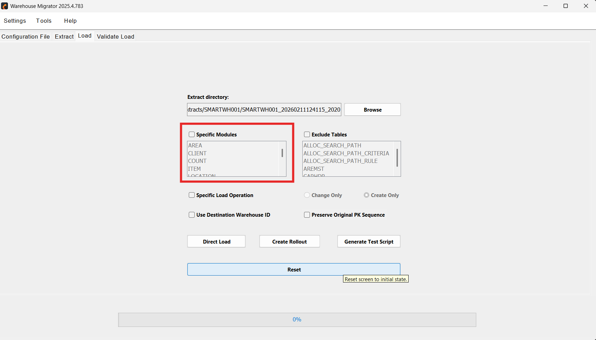
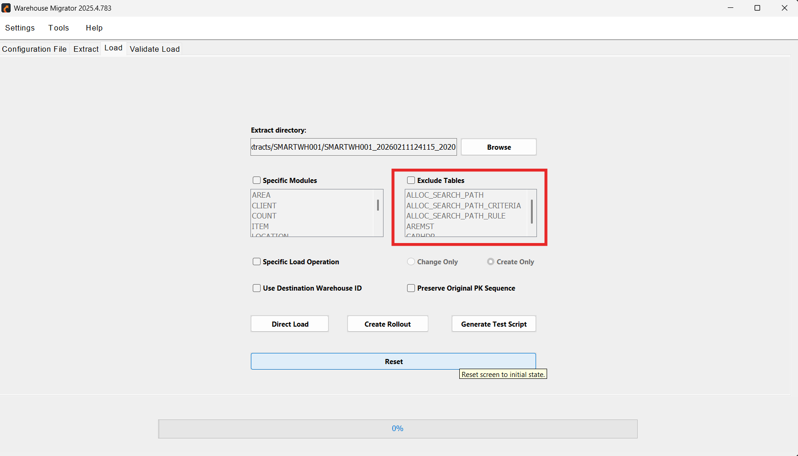
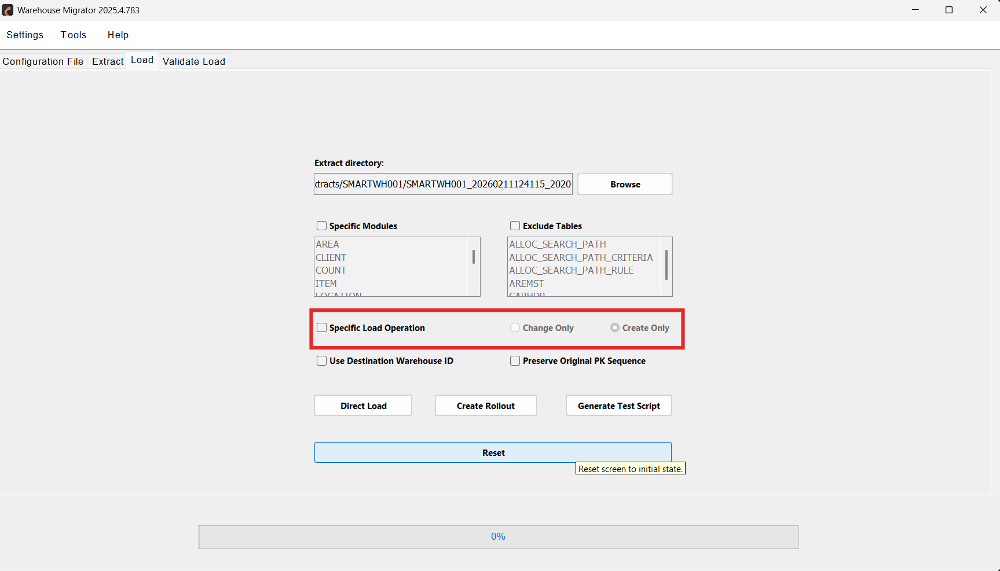
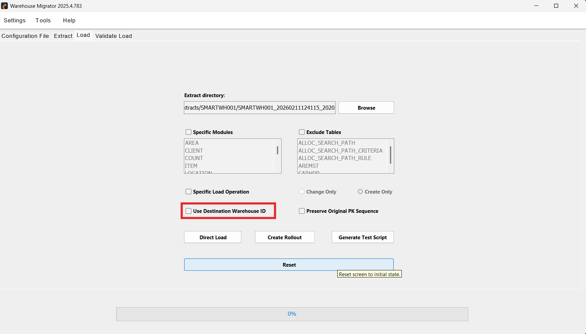
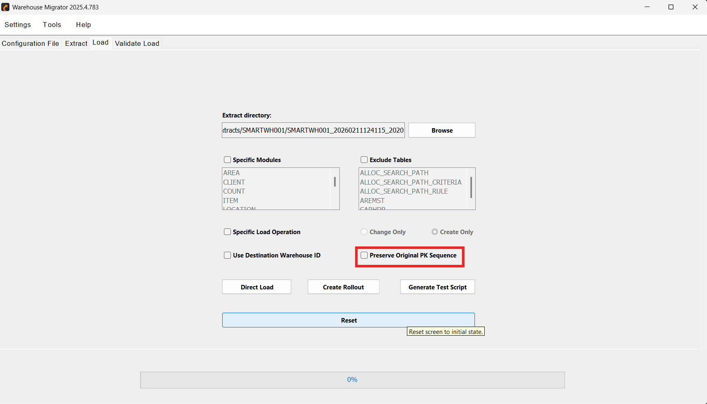
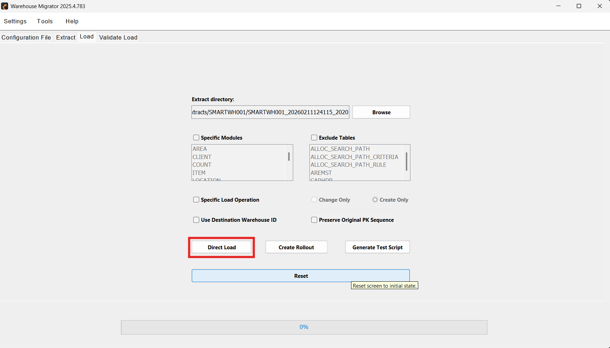
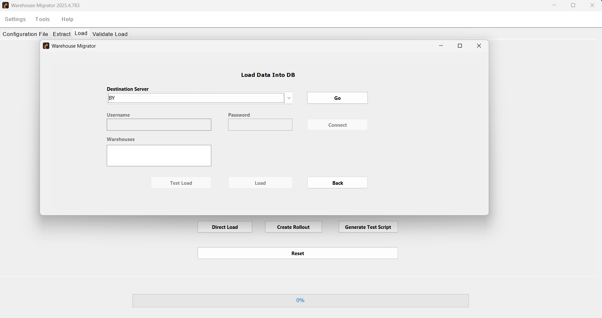
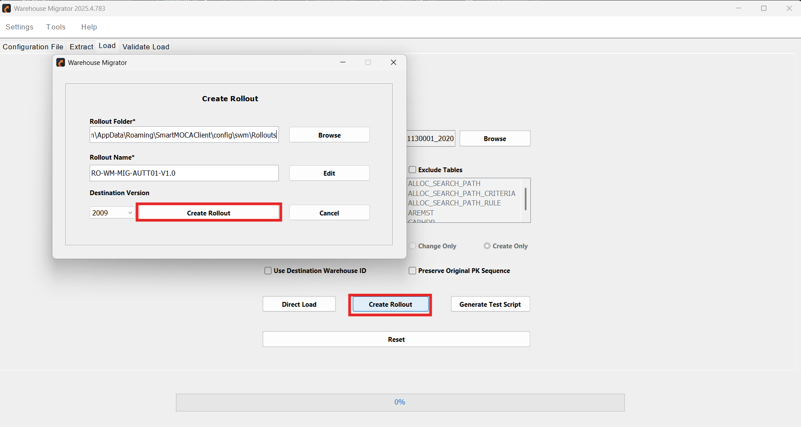
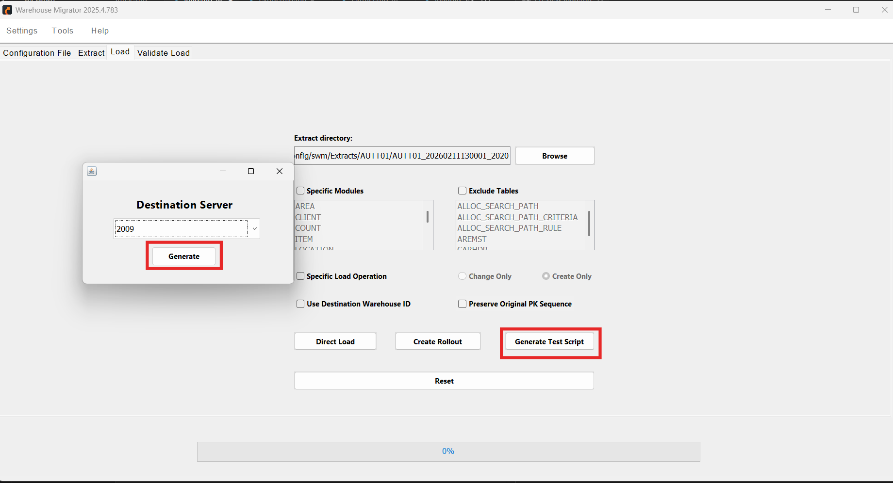

# Load 

The Load  enables users to import previously extracted warehouse configuration data into a destination environment in a structured and controlled manner.

## Purpose 

The Load feature is designed to:

- Deploy extracted warehouse configurations into a target environment  
- Maintain structured and dependency-aware data insertion  
- Support controlled, repeatable, and validated deployments  
- Enable quick promotions as well as complex rollout scenarios  

## Load Methods

**1. Direct Load**

Direct Load performs immediate data insertion into the destination server by specifying the extract path.

**Key Characteristics:**
- Fast execution  
- Direct data insertion  
- Supports remote environment data loads via remote calls  
- Requires connection to the destination server  

**Ideal For:**

- DEV → TEST promotion  
- Same-version environment migration  
- Internal testing scenarios  
- Quick and straightforward deployments  

**2. Rollout**

Rollout creates a structured deployment package at a specified path.  
This rollout file can later be installed on any Blue Yonder environment using the standard rollout deployment mechanism (including Perl-based setup where required).

**Key Characteristics:**

- Structured and reusable deployment package  
- Includes support for custom tables  
- Suitable for version upgrades  
- Enables standardized and repeatable deployment  

**Ideal For:**

- Controlled execution  
- Traceability and audit requirements  
- Standardized enterprise deployment  
- Multi-environment or multi-client rollout  

**3. Test Load**

Test Load validates the configuration before performing a full load.

**Key Characteristics:**

- Loads only the first 10 rows per entity  
- Validates table structure  
- Detects schema mismatches  
- Provides pre-validation before full deployment  

**Ideal For:**

- Verifying environment compatibility  
- Testing module selection and exclusions  
- Reducing risk before full production load  

## How to Load 

Follow the steps below to load extracted warehouse configuration data into a destination environment:

1. Open the **Load** tab from the application menu and in the **Extract Directory** field, select the folder containing the previously extracted warehouse data.

  

     
    

                
 The system reads the structured folders in sequence order to maintain parent-child relationships and ensure proper configuration setup.

2. Before initiating the load, review and configure the following options as needed:

 - **Specific Modules:** Allows you to load only selected modules instead of the full warehouse configuration.  
This is useful when performing targeted updates or module-specific deployments.

  

     
    

> ⚠️ When a specific module is selected, only the related tables will appear in the **Exclude Tables** list.

- **Exclude Tables**

Enables you to exclude selected tables from being loaded.  
If no module is selected, tables can be manually excluded from the complete list.

  

     
    

- **Specific Load Operation**

    Choose how the data should be applied in the destination environment:

    -  **Change Only**  
  Loads only modified or updated data.  
  Ideal for incremental updates without affecting unchanged records.

  - **Create Only**  
  Creates new data and tables without modifying existing records.  
  Suitable for initializing new warehouse setups.

    

     
    

    
- **Use Destination Warehouse ID**

    When enabled, the system retrieves the default Warehouse ID (`def_flg = 1`) from the connected destination environment and applies it during the load.

    

     
    

    This is particularly important when:

    - The `WH_ID` column was hidden during extraction  
    - Loading into a different warehouse instance  
    - Cloning configurations across environments  

- **Preserve Original PK Sequence**

    When this option is selected, the original primary key sequence values from the extract are preserved during the load process.

    

     
    

3. Once all configurations are finalized, select the appropriate load method based on your requirements:

    - **Direct Load**  
    Immediately loads data into the connected destination environment.

    

     
    

    Connect to the destination server and add credentials. Select Load to start Loading process.

    

     
    

- **Create Rollout**  
  Generates a structured rollout package that can be deployed later using standard rollout mechanisms.  
  Ideal for controlled and repeatable deployments.

    

     
    

    Select Create Rollout and fill all the required fields to proceed.

- **Generate Test Script**  
  Loads only the first 10 rows per entity to validate structure and schema compatibility before full execution.

    

     
    

    Select the Destination Server and generate.

After selecting the desired method, click **Load** (or generate the rollout/test script) to initiate the process.

 
---
