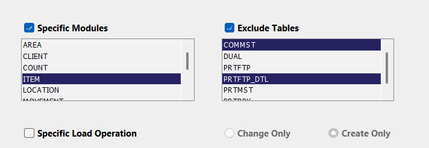
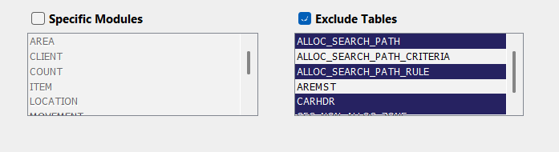

# Load

The **Load Tab** enables users to load extracted data onto the server by specifying the extraction path. Two main methods are available for loading the data: **Direct Load** and **Create Rollout**, each catering to different needs.

  

     
    

## Load Methods

1. **Direct Load:** 
   Directly loads extracted data onto the destination server by specifying the data path.

    **Key Features:**
      - Supports remote data loading via remote calls between environments.
      - Ideal for quick and straightforward data loading tasks.

2. **Create Rollout:**
    Creates a rollout file, specifying the data path and details about custom tables to be created.
    **Key Features:**
      - The rollout file can be used with Perl to load data and set up tables in any environment.
      - Provides flexibility for more complex and controlled setups.

---

## Load Tab Components

- **Extract Directory**
  - Specifies the directory path where the **Warehouse (WH)** data will be loaded.

- **Specific Modules**
  - Filters modules and tables from the load file, enabling users to focus on specific datasets.

- **Exclude Tables**
  - Allows filtering to exclude selected tables from being loaded based on the chosen modules.

    

     
    

  - When a user selects a specific module (e.g., ITEM) from the Specific    Modules list, the Exclude Tables section should dynamically display only the tables related to the selected module. Users should be able to select and exclude multiple tables from this filtered list.

    

     
    

  -  If no specific module is selected, users can still exclude multiple tables by manually selecting them from the Exclude Tables list.
- **Specific Load Operation**
  - Choose between different load methods for specific operations:
  - **Change Only**: Loads only modified data, ideal for incremental updates.
  - **Create Only**: Loads and creates new data and tables without modifying existing data. Suitable for initializing new datasets.

- **Use Destination Warehouse ID**
  - Retrieves the default **Warehouse ID** (def_flg 1) from the connected environment.
  - Note: If the **Hide WH_ID** option is enabled in user preferences, this option must be checked to retrieve the default Warehouse ID.
  

### Direct Load

This method directly loads the extracted data onto the destination server with a simple click and selection process. Remote loading between different environments is supported through remote calls.

  

     
    

  **Key Options:**

  - **Destination Server**: Specifies the target environment for the data load.
  - **Remote Server**: Facilitates loading data remotely to another environment.
  - Requires connection to the environment specified as the **Destination Server**.
  - **Remote Load**: Enables remote load operations between environments.
  - **Test Load**: Performs a test load, where only the first 10 rows of each table are loaded to the target environment for verification before full data loading.
  - **Load**: Initiates the loading process after completing all fields.

---

### Create Rollout

This method allows the creation of a rollout file for more complex setups, which can be later used to load data and create tables using Perl in any environment.

  - **Steps:**
    1. Specify the rollout directory.
    2. Optionally, customize the naming convention of the rollout file.
    3. Fill in required fields and generate the rollout.

  

     
    

The rollout file contains all necessary data and table details, which can be loaded into any environment using Perl.

### Generate Test Script

  - Creates a test script that loads only the first 10 rows of data, offering a way to test the data loading process without performing a full load.

  

     
    

### Notes

  - **Test Load** is useful for validating the setup before committing to a full data load.
  - **Create Rollout** is best for complex scenarios that require more control and flexibility during the data setup and loading process.

---