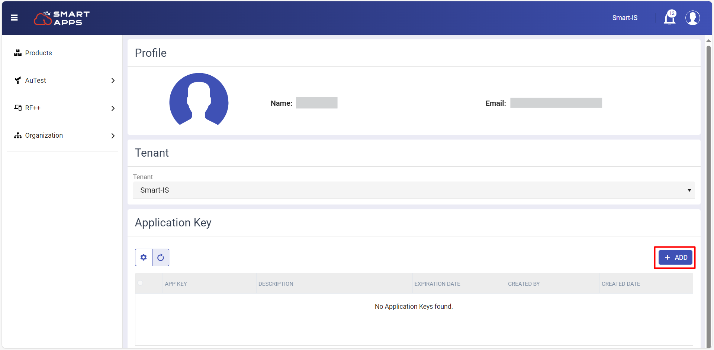
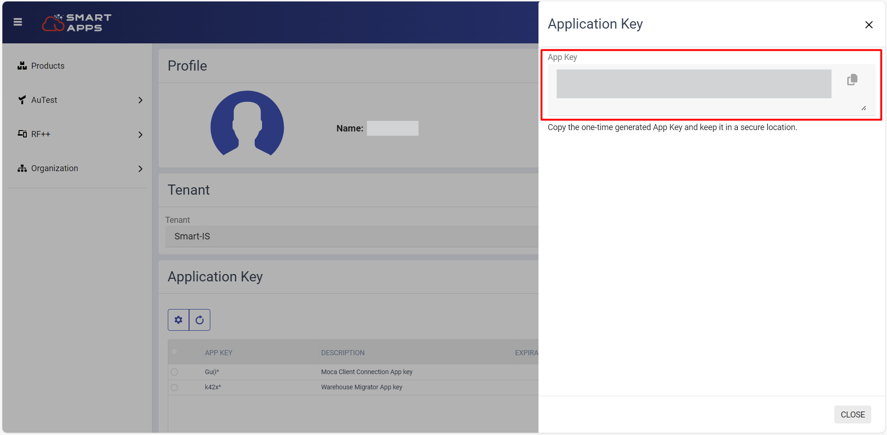
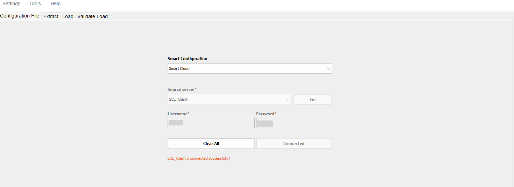

# Getting Started

This section will guide you through the initial steps to get you up and running with our powerful and intuitive software. 

## Pre-Requisites for using Warehouse Migrator

- **Smart Moca Client Installation**

  To use the Warehouse Migrator tool, the MOCA Client must be installed. 

  - If not installed, follow the instructions at [Smart Moca Client-Installation](https://oracularis.github.io/mocaclient/#/./getting-started?id=installation).

  This process will allow you to launch warehouse migrator within Smart Moca Client successfully.

## Environment Setup for Warehouse Migrator

- To setup your servers, navigate to File > Edit Servers from top menu bar.

  
   

 

- Fill out the details by ensuring your MOCA connection URL includes /service and click on 'Add/Update' button to add server information.
  - If the URL is missing /service, add the connection details for the server where you intend to run the migrator.

  
   

- Now choose a server name and click on 'Connect' button or press Alt + C.

  
   

## Warehouse Migrator Cloud Connect
After successfull installation of Smart Moca Client, we have to configure the Warehouse Migrator. 

To configure warehouse migrator in smart moca client, follow the instructions below:

-	Go to [Smart Apps](https://apps.smart-is.com/) or scan the QR code and create your account.

  
   

  
   

-	After signing in, open your profile by clicking on top right profile icon and select “Profile” option. 

  
   

-	Press the Add button to create your api key.

  
   

- Now give description to your app key and click on "Generate" button. 

  
   

-	This action will generate a new one-time generated app key containing all your license information. Once the app key is generated, copy it to your clipboard. 

  
   

- Now navigate to the Smart Connect --> Cloud Connect from dropdown menu and enter key which is generated from website and press 'Save' Key button.

  
   

## Launching Warehouse Migrator
Follow below steps to launch warehouse migrator:

- Once connected to the server, navigate to Addons > Smart Innovations > Warehouse Migrator.

  
   

- The Warehouse Migrator will get launch, indicating that the configuration was successful and the tool is ready for use.

  

  
   

---

