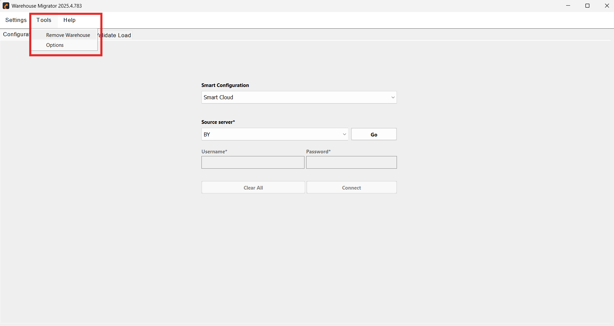

# Remove Warehouse
Remove Warehouse feature can be accessed from the tools tab. 

  

     
    

This interface provides secure and customizable options for managing warehouse removal while allowing for data-specific actions and backups.

  

     
    

  - **Server (Required)**
    - Dropdown to select the server where the warehouse resides.

  - **Connect**
    - Establishes a connection to the selected server.

  - **User Authentication**
    - Fields for entering **Username** and **Password** to authenticate access to the server.

  - **Login**
    - Logs the user into the selected server.

  - **Warehouse Selection (Required)**
    - Dropdown to choose the specific warehouse for removal.

  - **Specific Data**: Checkbox to remove specific data from the warehouse.
  - Radio buttons to choose the type of data to remove:
    - **Transaction**: Removes transaction-related data.
    - **Configuration**: Removes configuration-related data.

  - **Backup**: Creates a backup of the warehouse data before initiating removal.
  - **Remove**: Executes the warehouse removal process based on the specified options.
  - **Cancel**: Discards changes and exits the interface.

⚠️ *Note: Warehouse removal is irreversible unless a backup is created.*

  ---