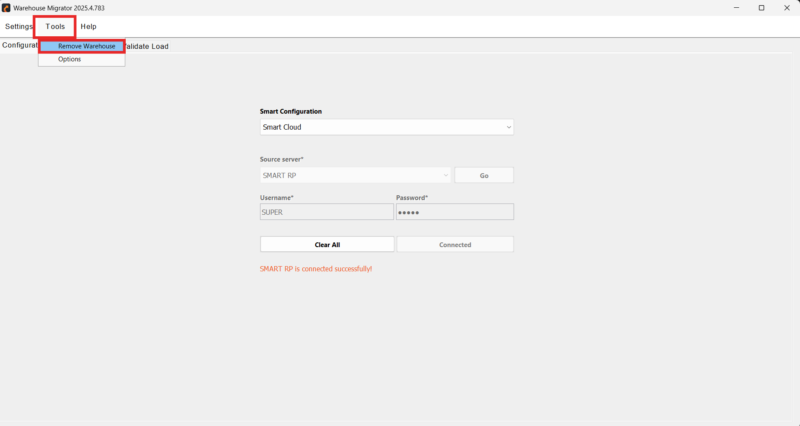
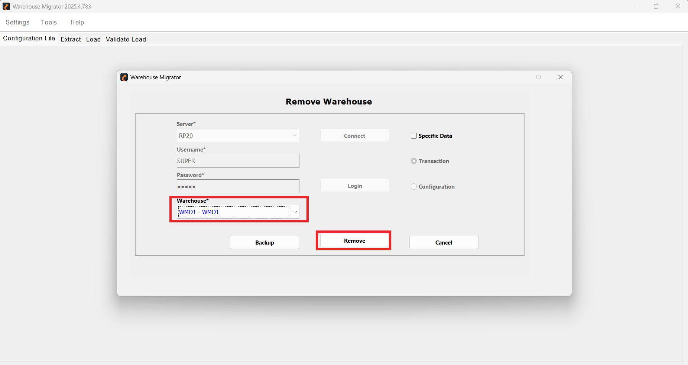

# Remove Warehouse 

The **Remove Warehouse** feature allows authorized users to permanently remove an entire warehouse or selectively delete specific warehouse data from a connected server.

This feature is accessible from the **Tools** tab.

  

     
    

## How to Remove Warehouse 

1. Choose the **Server** from the dropdown list and click **Connect**.
- Enter your **Username and Password**.  
- Click **Login** to authenticate and establish connection.
- From the **Warehouse Selection** dropdown, choose the warehouse to be removed.

This selection is mandatory.

  

     

> Ensure you are connected to the correct destination environment before proceeding.

2. You can either remove the entire warehouse or selectively remove specific data.

    Enable the **Specific Data** checkbox to remove selected data types instead of the entire warehouse.

    Then choose one of the following options:

    - **Transaction**  
  Removes only transaction-related data.

    - **Configuration**  
  Removes configuration-related data.

    If the Specific Data option is not selected, the system will remove the entire warehouse.

3. Click **Remove** to initiate the removal process based on selected options.  
You can discard changes and exit without making modifications by clicking **Cancel** .

## Safety Checklist Before Warehouse Removal

Before executing warehouse removal, ensure the following:

-  Take a full database backup  
-  Confirm the correct environment (DEV / TEST / PROD)  
- Verify the Warehouse ID  
- Obtain required approvals from leadership or system owners  
- Notify relevant stakeholders  
-  Confirm no active users or processes are using the warehouse

---