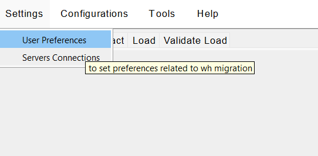
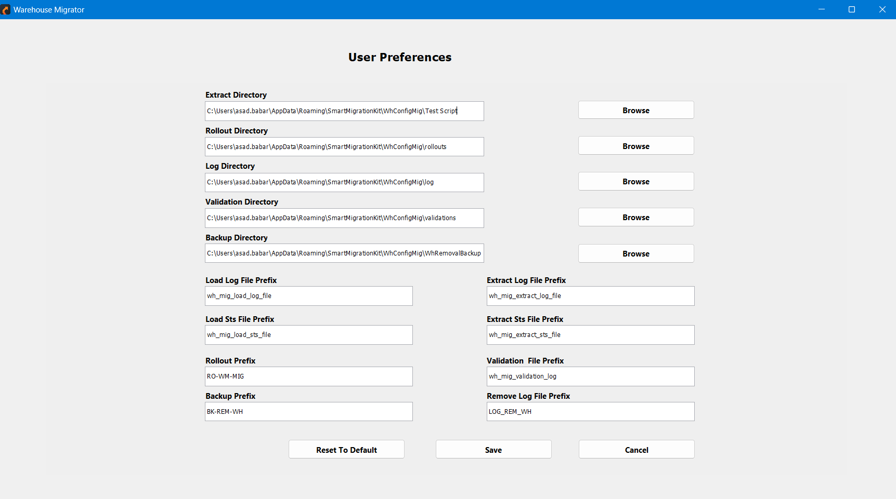
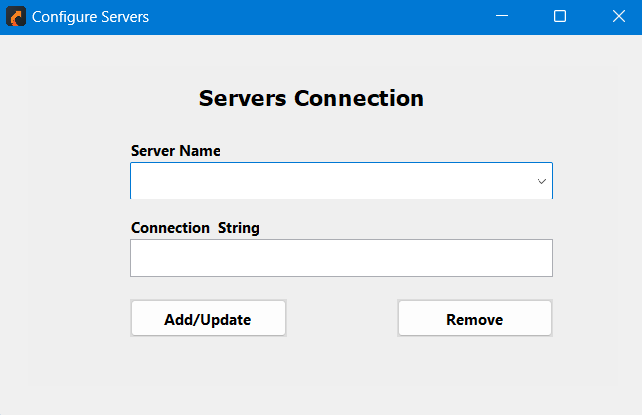

# Settings

Warehouse Migrator offers robust configuration options, allowing users to tailor both server settings and personal preferences to optimize their experience.
  
  

     
    
 

## User Preferences

Used to set up the directory for storing logs and data. This screen allows customization of log file and status file naming conventions.

  

     
    

- **Directories Setup**
  - Allows users to specify paths for the following directories:
    - **Extract**
    - **Rollout**
    - **Log**
    - **Validation**
    - **Backup**
    - Use the **Browse** button for easy directory navigation.

- **File Prefixes**
  - Customize prefixes for:
    - **Log files**
    - **Status files**
    - **Rollout files**
    - **Backup files**
    - **Validation logs**

  This enables unique naming conventions for better file organization.

- **Reset and Save Options**
  - **Reset to Default**: Resets all configurations to their default values.
  - **Save**: Saves the current preferences.
  - **Cancel**: Discards changes and exits the preferences menu.

---

## Server Connections

Used to add a server connection to either the source or destination.

  

     
    

- **Server Name**
  - Dropdown menu to select or input the name of the server to configure.

- **Connection String**
  - Field to enter or update the connection string for the selected server.

- **Buttons**
  - **Add/Update**: Adds a new server configuration or updates the connection string for the selected server.
  - **Remove**: Deletes the selected server configuration.

  This interface provides an easy way to manage server connections in the application.

---

