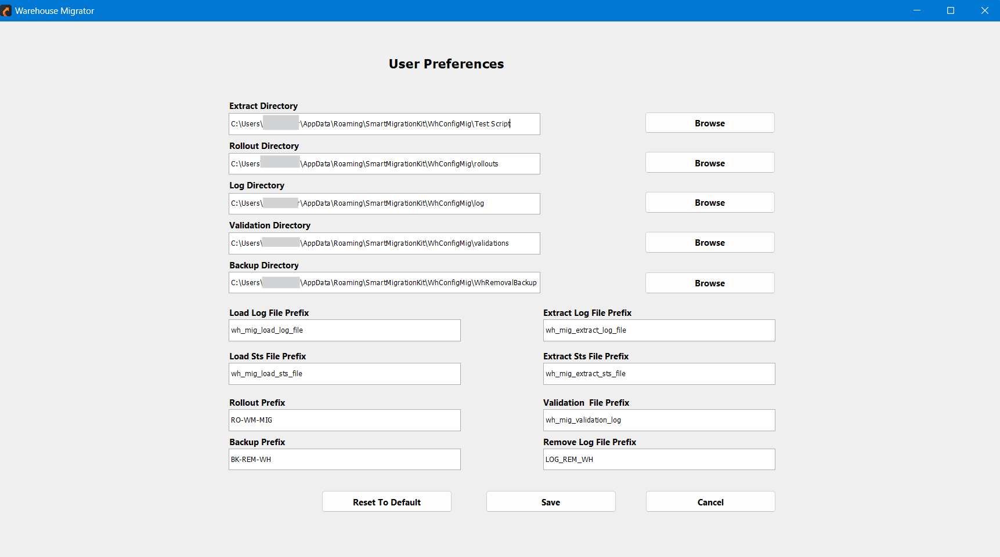

# Settings

**Smart Warehouse** offers robust configuration options, allowing users to tailor both server settings and personal preferences to optimize their experience.

---

## User Preferences

Used to set up the directory for storing logs and data. This screen allows customization of log file and status file naming conventions.

### Directories Setup
- Allows users to specify paths for the following directories:
  - **Extract**
  - **Rollout**
  - **Log**
  - **Validation**
  - **Backup**
- Use the **Browse** button for easy directory navigation.

### File Prefixes
- Customize prefixes for:
  - **Log files**
  - **Status files**
  - **Rollout files**
  - **Backup files**
  - **Validation logs**
- This enables unique naming conventions for better file organization.

### Reset and Save Options
- **Reset to Default**: Resets all configurations to their default values.
- **Save**: Saves the current preferences.
- **Cancel**: Discards changes and exits the preferences menu.

---

## Server Connections

Used to add a server connection to either the source or destination.

### Server Name
- Dropdown menu to select or input the name of the server to configure.

### Connection String
- Field to enter or update the connection string for the selected server.

### Buttons
- **Add/Update**: Adds a new server configuration or updates the connection string for the selected server.
- **Remove**: Deletes the selected server configuration.

This interface provides an easy way to manage server connections in the application.

---

## Warehouse Removal Configuration

### Table Name
- Field to specify the name of the table targeted for removal.

### Table Alias (Required)
- Field to define an alias for the table (this is a mandatory input).

### Where Clause
- Field to input conditions for selective data removal (e.g., SQL WHERE clause).

### Catch Exception
- Predefined exception codes to handle errors during the removal process.

### Data Type
- Dropdown to select the type of data to be removed (e.g., **TRANSACTION**).

### Moca Cmd (Optional)
- Checkbox to enable the execution of a **MOCA** command for advanced removal configurations.

### Enabled
- Checkbox to activate or deactivate the configuration.

### Action Buttons
- **Add/Update**: Saves or updates the removal configuration.
- **Remove**: Deletes the specified configuration.
- **Cancel**: Cancels the operation and exits the interface.

This interface facilitates precise configurations for removing specific tables or data from the warehouse.

---
## Tools

### Remove Warehouse

### Server (Required)
- Dropdown to select the server where the warehouse resides.

### Connect
- Establishes a connection to the selected server.

### User Authentication
- Fields for entering **Username** and **Password** to authenticate access to the server.

### Login
- Logs the user into the selected server.

### Warehouse Selection (Required)
- Dropdown to choose the specific warehouse for removal.

### Data Removal Options
- **Specific Data**: Checkbox to remove specific data from the warehouse.
- Radio buttons to choose the type of data to remove:
  - **Transaction**: Removes transaction-related data.
  - **Configuration**: Removes configuration-related data.

### Backup Option
- **Backup**: Creates a backup of the warehouse data before initiating removal.

### Action Buttons
- **Remove**: Executes the warehouse removal process based on the specified options.
- **Cancel**: Discards changes and exits the interface.

This interface provides secure and customizable options for managing warehouse removal while allowing for data-specific actions and backups.

---

## Options Submenu

