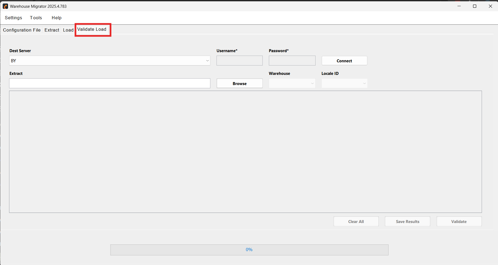
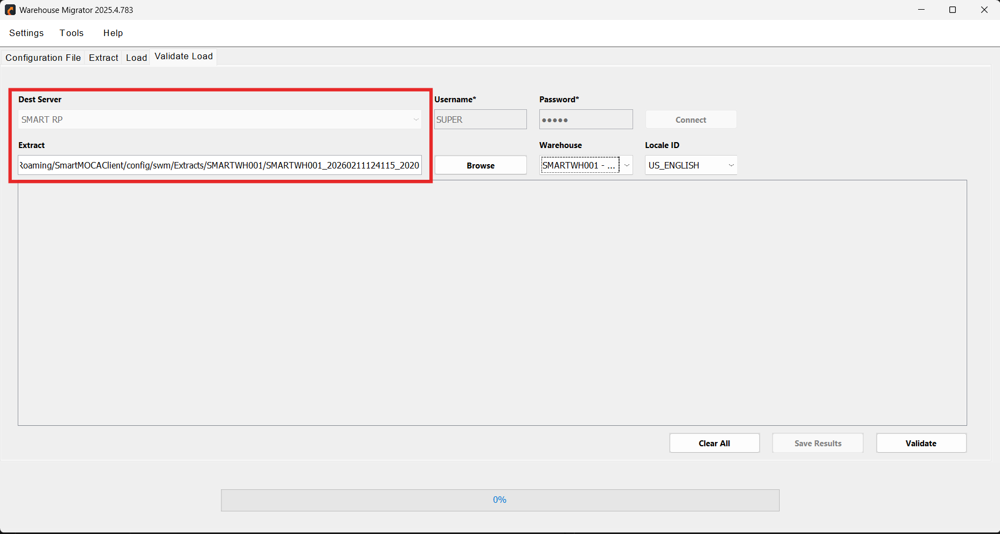
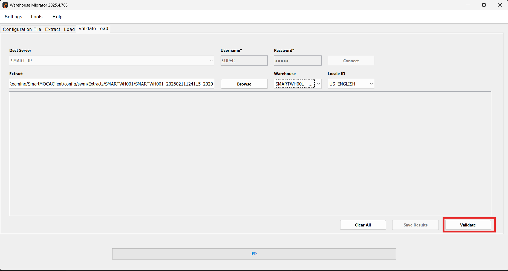

# Validate Load 

The **Validate Load** feature verifies that the data successfully loaded into the destination environment matches the originally extracted configuration data.

By comparing source extract data with destination database records, Validate Load helps detect inconsistencies, missing records, and structural mismatches—ensuring data integrity before business operations begin.

## Use Cases

Validate Load is particularly useful in the following scenarios:

- Detecting mismatched row counts after migration  
- Identifying missing configuration records  
- Ensuring environment consistency after DEV → TEST → PROD promotion  
- Validating version upgrade loads  
- Preventing production instability  

This step acts as a safety checkpoint before go-live.

## How to Load

1. Navigate to the Load Validate tab.

  

     
    
 

2. Connect to the target environment where the extracted data was loaded and select the folder containing the extracted warehouse data.  

  

     
    

3. Click the validate button to start the validation process. 

  

     
    

## Save Results

Validation results can be saved in **CSV format** for:

- Audit documentation  
- Compliance tracking  
- Further analysis  
- Sharing with stakeholders 

## Validation Checklist

Before marking the migration as complete, it is recommended to:

- Compare row counts between extract and destination tables  
- Review the generated log file for any errors  
- Check critical configuration tables  
- Validate UI functionality in the destination environment  
- Confirm key business flows are working correctly

---