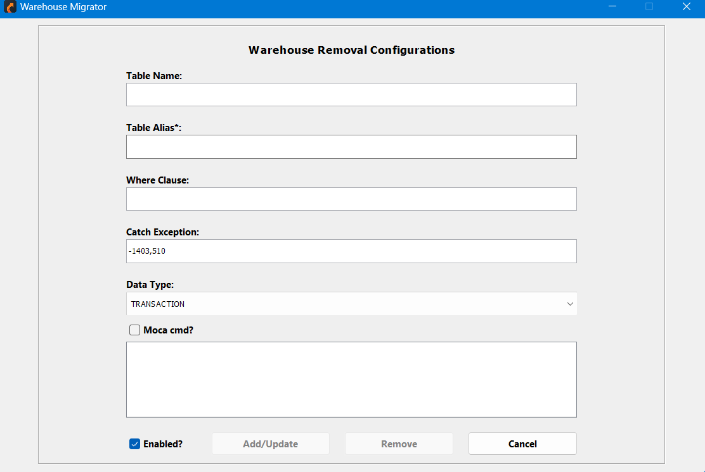

# Warehouse Removal Configuration

This interface provides a user-friendly platform for configuring and managing the removal of specific tables or datasets from the warehouse. It ensures efficient and accurate data handling while maintaining compliance with operational requirements and business rules.

- **Table Name**
    - Field to specify the name of the table targeted for removal.

- **Table Alias** (Required)
    - Field to define an alias for the table (this is a mandatory input).

- **Where Clause**
    - Field to input conditions for selective data removal (e.g., SQL WHERE clause).

- **Catch Exception**
    - Predefined exception codes to handle errors during the removal process.

- **Data Type**
    - Dropdown to select the type of data to be removed (e.g., **TRANSACTION**).

- **Moca Cmd (Optional)**
    - Checkbox to enable the execution of a **MOCA** command for advanced removal configurations.

- **Enabled**
    - Checkbox to activate or deactivate the configuration.

- **Action Buttons**
    - **Add/Update**: Saves or updates the removal configuration.
    - **Remove**: Deletes the specified configuration.
    - **Cancel**: Cancels the operation and exits the interface.
